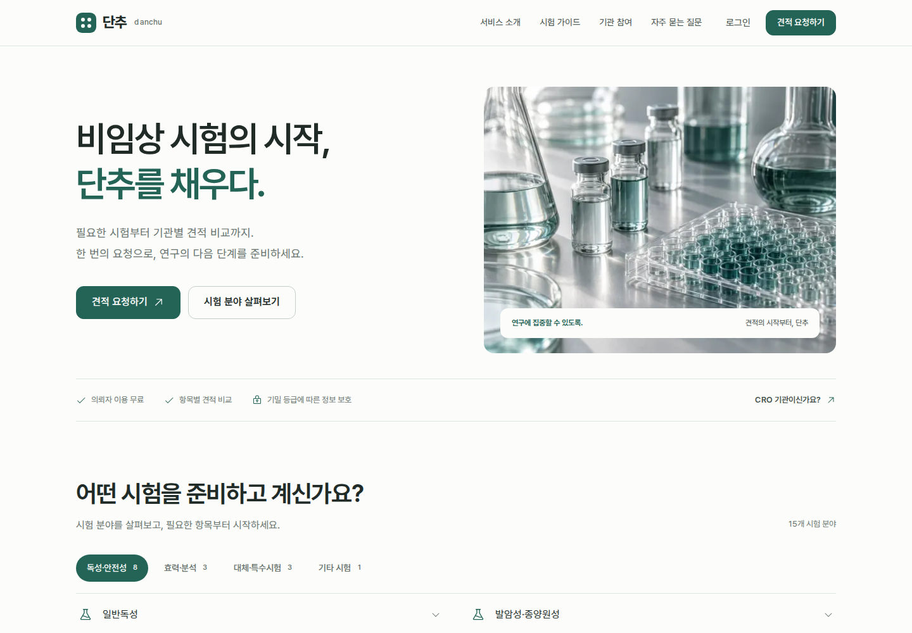

# 단추 디자인 검토안

작업 브랜치: `design/nonclinical-workspace`  
검토 기준 커밋: `7e0c4be58868736f7fd153de1b2224d8f79fa652`  
`main` 병합 및 운영 배포를 수행하지 않았습니다.



## 검토와 변경

| Before | After | Why |
|---|---|---|
| 첫 화면에 긴 설명과 상세 시험 제안 폼이 함께 노출 | 짧은 핵심 설명, 견적 요청, 시험 분야 탐색 | 서비스 이해와 첫 행동을 빠르게 연결 |
| 랜딩에 양식 명세·긴 비교표·전체 진행 설명이 연속 배치 | 핵심 흐름을 짧게 설명하고 상세 내용은 `/how-it-works`로 이동 | 처음 방문한 사람이 읽어야 할 정보량을 줄이고 세부 내용은 보존 |
| 공개 워드마크와 포털 마크가 다름 | 네 구멍 단추 마크와 동일 색·모서리 체계 | 랜딩부터 업무 화면까지 하나의 서비스로 인식 |
| 요청 카드가 최근순으로만 표시 | 상태별 필터·요청 검색·정렬된 열·빈 결과 복구 | 여러 요청을 동시에 관리하기 쉽게 개선 |
| 모바일 메뉴가 일반 div 모달, 제안 select가 상태 변경 때 재생성 | native dialog·포커스 복귀, 안정적으로 유지되는 select | 키보드와 모바일 상호작용 안정성 |
| 공개 CSS의 `.ph`, `.card` 등이 포털 클래스와 충돌 가능 | 공개 스타일을 `.site` 내부로 한정 | 페이지 이동 후에도 스타일 일관성 유지 |

## 화면

- [랜딩 전체](landing-full.png)
- [모바일 랜딩](mobile.png)
- [의뢰자 워크스페이스](workspace.png)
- [로그인](login.png)

## 실행

```bash
npm ci
npm run dev
```

공개 화면은 Supabase 환경변수가 없어도 볼 수 있습니다. 실제 가입·로그인·견적 저장에는 기존 `.env.example`의 연결 정보가 필요합니다.

업무 화면의 디자인을 예시 데이터로 확인하려면 `.env.local`에 다음 한 줄을 넣고 서버를 다시 시작하세요.

```dotenv
DANCHU_DESIGN_PREVIEW=1
```

- `/design-preview`: 실제 의뢰자 목록 컴포넌트 + 명시된 합성 데이터
- `/design-preview?empty=1`: 빈 목록
- `/design-preview?role=cro`: CRO 공통 셸·입력·표 스타일
- `/design-preview?role=admin`: 운영자 공통 셸·입력·표 스타일

검토 화면은 기본적으로 404입니다. 인증 우회나 실제 데이터 접근을 추가하지 않았으며 업무 링크는 기존 인증 경로로 갑니다. 합성 데이터는 실제 기관·거래·이용 실적이 아닙니다. 운영 환경에서는 이 플래그를 켤 필요가 없습니다.

## 검증

- TypeScript: 통과
- 기존 Vitest: 5개 파일, 35개 테스트 통과
- Next.js 프로덕션 빌드: 통과
- Playwright: 1440px / 390px, 라이트·다크, 랜딩·로그인·포털 예시·가이드·이용 안내 총 13개 화면
- 문서 전체 가로 넘침 및 브라우저 실행 오류 없음. 업무 표는 작은 화면에서 자체 컨테이너 안으로 가로 스크롤됩니다.
- 시험 분야 필터·펼침, 시험 제안 select 및 키보드 포커스, 가입 CTA, 모바일 메뉴 Escape/포커스 복귀, 요청 상태 필터·검색·검색 결과 없음/초기화, 로그인 방법 전환 확인

실제 계정과 Supabase/Resend 환경 정보가 없어 가입 메일, DB 저장, CRO 회신, 계약 보고를 실서비스에서 완료하는 검증은 하지 않았습니다. 해당 API·권한·마이그레이션은 변경하지 않았습니다. CRO·운영자 검증은 공통 컴포넌트 범위이며 모든 실제 업무 화면의 데이터 상태를 검증한 것은 아닙니다.

## 자산과 인수인계

- 디자인 기준: 루트 `DESIGN.md`, 토큰: `app/globals.css`
- 생성 이미지: `public/images/lab-glassware.webp`, 생성 지시·출처: 같은 폴더의 `lab-glassware.prompt.txt`
- 이미지 제작: OpenAI 내장 이미지 생성. 특정 기관의 사진이 아닌 브랜드 분위기용 이미지입니다.
- 신규 의존성: `@phosphor-icons/react` 하나. Tailwind 미사용.
- 기존 footer의 사업자 정보 placeholder는 공개 화면에서 제거했습니다. 서비스 공개 전 실제 사업자 정보가 준비되면 별도로 반영해야 합니다.

추가 확인: 플래그를 끈 `/design-preview`는 404, 인증 미설정 상태의 `/app`은 기존 로그인 경로로 307 리다이렉트됩니다. 독립 디자인 리뷰 결과는 `ship`이며, 제출한 9개 주요 캡처에서 수정이 필요한 시각적 결함을 발견하지 못했습니다. 외부 디자인 후보 카탈로그를 사용할 수 없어 저장소 기준과 실제 화면을 바탕으로 검토했습니다.

GitHub 설치는 확인했으나 현재 세션의 GitHub 쓰기 도구와 CLI 인증이 제공되지 않아 원격 push/PR은 수행하지 못했습니다. 전달 파일에는 로컬 커밋의 전체 소스 ZIP과 기준 커밋 대비 바이너리 포함 패치가 들어 있습니다.

기존 저장소에 적용하려면 기준 커밋을 확인한 뒤 별도 브랜치에서 패치를 적용하세요. 현재 main에 다른 변경이 있으면 자동으로 덮어쓰지 말고 3-way 결과를 검토하세요.

```bash
git switch -c design/nonclinical-workspace
git apply --3way /path/to/danchu-redesign.patch
npm ci
npm run typecheck
npm test
npm run build
```
